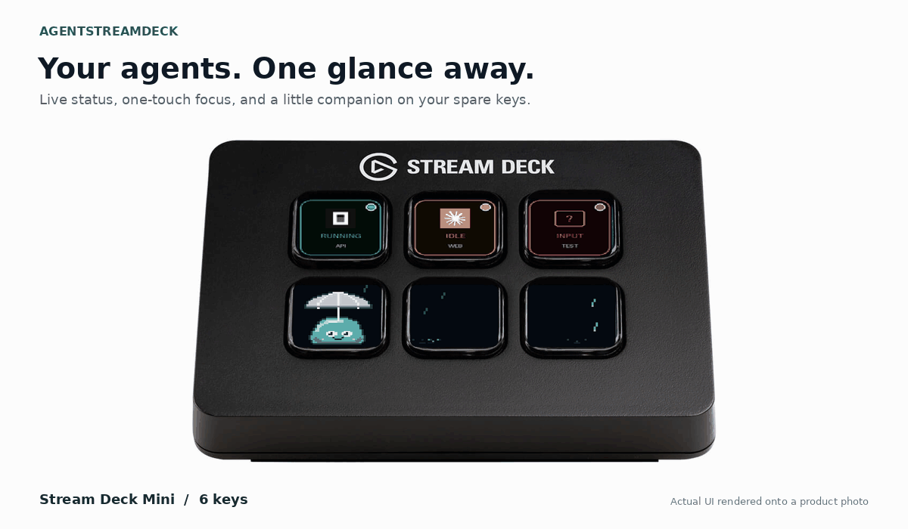
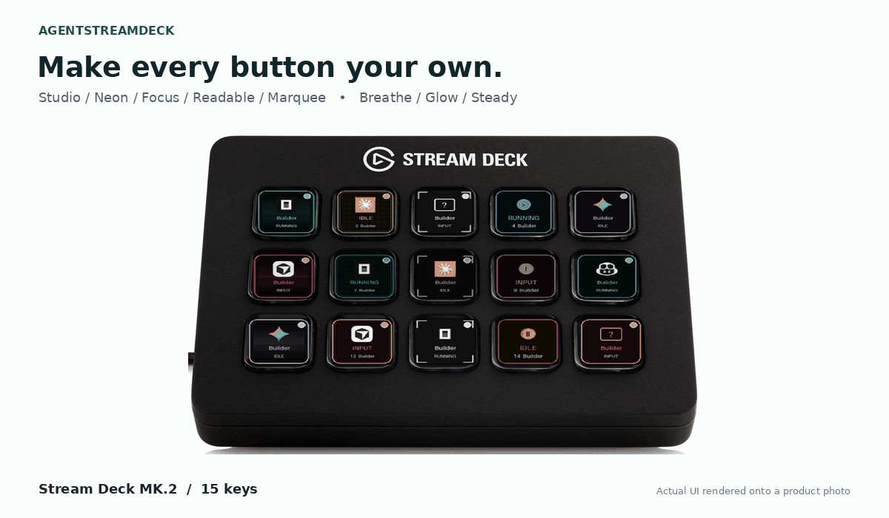
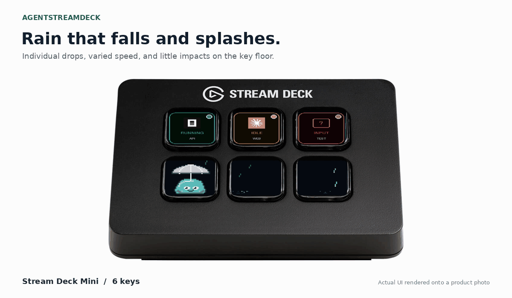

# AgentStreamDeck

**A physical dashboard for your AI coding agents.** Monitor OpenCode, Claude Code, Codex CLI, GitHub Copilot, Gemini CLI and Cursor CLI on an Elgato Stream Deck. See who is working or needs you, press a key to return to that window, and let Jelly bring your spare buttons to life.

[](https://github.com/darkmatter2222/AgentStreamDeck/stargazers)
[](https://github.com/darkmatter2222/AgentStreamDeck/forks)
[](https://github.com/darkmatter2222/AgentStreamDeck/releases/latest)
[](https://pypi.org/project/agentstreamdeck/)
[](https://pypi.org/project/agentstreamdeck/)
[](https://github.com/darkmatter2222/AgentStreamDeck/actions/workflows/ci.yml)
[](pyproject.toml)
[](docs/integrations/README.md)
[](LICENSE)

> **⭐ Find this useful? [Star AgentStreamDeck on GitHub](https://github.com/darkmatter2222/AgentStreamDeck)** to help more developers discover it.
>
> **☕ [Support Ryan’s projects](https://buymeacoffee.com/j6oiubzfnh)** on Buy Me a Coffee. Any amount, one-time or monthly, helps fund development, hardware testing and videos. Thank you for supporting this hobby.

[](https://buymeacoffee.com/j6oiubzfnh)

<p align="center">
  
</p>

[Get started](#get-started) · [Watch the video](#watch-agentstreamdeck-on-a-real-stream-deck) · [All features](#explore-every-feature) · [CLI reference](docs/CLI.md) · [UI options](docs/UI.md) · [Visual gallery](docs/GALLERY.md) · [Documentation](docs/README.md)

## Watch AgentStreamDeck on a real Stream Deck

[](https://www.youtube.com/watch?v=NTWLbLbJiO0)

**[▶ Watch the YouTube demo: AI coding-agent status and one-touch window switching](https://www.youtube.com/watch?v=NTWLbLbJiO0).** This is the original OpenCode hardware walkthrough, recorded before later Jelly and customization additions. The source-rendered hero above and [full animation gallery](docs/GALLERY.md) show the broader current feature set. The thumbnail opens YouTube; GitHub README pages do not play embedded YouTube iframes.

## Keep your attention on the work

Running several coding agents means several windows to check. AgentStreamDeck gives each session a physical key with its project label, agent icon and live status.

- **Know where you're needed.** Animated status keys distinguish work in progress, idle sessions and supported input requests.
- **Get back with one press.** Focus the session's Windows window; minimized windows are maximized and brought forward.
- **Keep your usual workflow.** Launch your CLI or editor normally after installing its integration. No special launcher, Elgato plugin or MCP server required.
- **Give spare keys some personality.** Jelly plays on unused buttons, celebrates holidays and reacts to your local weather.

The hero above composites the actual application renderers onto product photos of the Mini, MK.2 and XL. These are illustrative previews. [The video demo](https://www.youtube.com/watch?v=NTWLbLbJiO0) shows the OpenCode workflow on hardware.

## Choose your deck

The same dashboard scales from six keys to thirty-two. Session keys stay in charge; Jelly uses the space that is free.

| Mini | Original / MK.2 | XL |
|---|---|---|
| 6 keys · 2 × 3 | 15 keys · 3 × 5 | 32 keys · 4 × 8 |
| Compact desk companion | Room for parallel projects | A larger view of your agent sessions |

[See the three hardware previews and photo sources](docs/hardware/README.md). Each broker controls one device. These capacities include agent keys and spare keys; Jelly yields when a session needs a slot.

## Get started

### 1. Check your setup

| You'll need | Supported setup |
|---|---|
| Stream Deck | Mini (6 keys), Original/MK.2 (15), or XL (32); one device per broker |
| Python | 3.11 or newer |
| Node.js | 20 or newer for hook adapters |
| Desktop | Windows for USB control and window focus; Linux supports the broker and device rendering, but not desktop focus |

Plug in your deck and **quit the Elgato Stream Deck app from the system tray** so AgentStreamDeck can use it.

### 2. Install and start

```powershell
python -m pip install --upgrade agentstreamdeck
python -m ocdeck install
```

The second command registers and starts the background broker for your user, including startup at login. It also installs the OpenCode plugin if `opencode` is on PATH. No repository checkout is needed. The commands use `python -m` so a missing Scripts folder on PATH won't get in your way.

### 3. Connect your agent

For Claude Code, run this from a project you want to monitor:

```powershell
cd C:\Projects\MyApp
python -m ocdeck harness-install claude
claude
```

For another agent, choose its profile below. Repeat hook installation for each project you want to monitor. Existing unrelated hooks are preserved. **OpenCode uses its global plugin**, so just launch `opencode` after step 2; if it wasn't on PATH during setup, run the install command again once it is.

| Agent | Project hook profile | What it can report |
|---|---|---|
| OpenCode | Global plugin; no project profile needed | Activity, permission requests and structured questions |
| Claude Code | `claude` | Activity, identified questions; permission counts may be unknown |
| Codex CLI | `codex` | Activity and observed approval state; counts unknown |
| GitHub Copilot CLI | `copilot-cli` | Activity only |
| Copilot in VS Code | `copilot-vscode` | Activity only; preview integration |
| Gemini CLI | `gemini` | Activity and recognized permission notifications |
| Cursor CLI | `cursor` | Activity only; Cursor desktop isn't included |

For example, use `python -m ocdeck harness-install codex`, then review and trust the hooks in Codex using `/hooks`. [Agent-specific setup and coverage](docs/HARNESSES.md) explains prerequisites and limitations.

### 4. Try a key

Start an agent in the configured project, send it a task and watch its key change. Press the key to return to that session. Use a separate OS window for each monitored session; several tabs in one terminal window can make focus ambiguous.

```powershell
python -m ocdeck status
```

Need more detail? [Installation guide](docs/PLUGIN-FIRST.md) · [Troubleshooting](docs/TROUBLESHOOTING.md) · [Remote and WSL setups](docs/REMOTE-AND-WSL.md)

## Supported agents

Follow the dedicated setup guide for [OpenCode](docs/integrations/OPENCODE.md), [Claude Code](docs/integrations/CLAUDE.md), [Codex CLI](docs/integrations/CODEX.md), [Copilot CLI](docs/integrations/COPILOT-CLI.md), [Copilot in VS Code](docs/integrations/COPILOT-VSCODE.md), [Gemini CLI](docs/integrations/GEMINI.md), or [Cursor CLI](docs/integrations/CURSOR.md). Each includes install commands, exact shipped hook mappings, verification and removal.

The integrations above share the same deck, but their event coverage differs. These are the default visual signals:

| Key | Meaning |
|---|---|
| Green moving ring | Agent reports work in progress |
| Amber breathing glow | Agent reports idle |
| Red attention indicator | Identified input request or observed approval state |
| Amber `LINK ?` | Connection or state is unknown |

**Activity-only integrations can still look busy while waiting for approval.** A green key doesn't guarantee that no input is needed. Input counts appear only when the integration supplies enough information.

A normal tap on an agent key requests window focus. Optional [deck controls](docs/features/DECK-CONTROLS.md) add a separate hold menu for launching sessions and explicitly accepting or rejecting supported native permission requests. Windows can restrict foreground activation; the status output includes the last focus result for diagnosis.

## Launch and review from the deck

Hold and release a key to choose a saved repository and agent, then launch a dedicated window in the right folder. Hold a session key to review a specific pending permission and press ACCEPT or REJECT. Native decisions are supported for Claude Code and the OpenCode server plugin; other harnesses offer terminal focus.

Everything is configurable from the CLI, including named folders, harness choices, custom BAT launchers, arguments and interaction timing. The controls are opt-in and preserve ordinary taps and Jelly interactions.

[Step-by-step tutorials](docs/TUTORIALS.md#launch-a-new-agent-without-leaving-the-deck) · [Feature guide and animated preview](docs/features/DECK-CONTROLS.md) · [CLI commands](docs/CLI.md#controls)

### What each press does

| Button or gesture | Result |
|---|---|
| Tap an agent | Return to its terminal or editor window |
| Hold and release a free key, with controls enabled | Choose a saved project and harness, then confirm launch |
| Hold and release an agent, with controls enabled | Open its session menu and supported request review |
| ACCEPT / REJECT | Decide the single displayed native request for supported Claude Code or OpenCode integrations |
| Tap Jelly | Pet reaction; five taps within a minute can invite a coffee break |
| Tap Jelly or the cup during the coffee invitation | Open Buy Me a Coffee and dismiss the invitation |
| Press Jelly with “Update available” | Install the detected update and restart |
| Hold Jelly for world help | Show setup guidance, then hold again for documentation; enabled controls take priority |


## Make it yours

The physical deck is the UI; preferences are configured through the CLI and JSON. See [every UI control](docs/UI.md), [every appearance field and default](docs/reference/APPEARANCE.md), and [all CLI arguments](docs/CLI.md).

Choose recognizable agent logos, project labels, layouts, color palettes and animation styles. Apply a preset across the deck or give individual keys their own look.



```powershell
python -m ocdeck appearance --preset neon --layout harness
```

Restart the broker after saving appearance changes. You can preview changes before saving, export a favorite look, or turn animation off. Sound alerts and Windows notifications are optional and off by default.

| Customize | Available options |
|---|---|
| Layout | Classic, harness logos, minimal |
| Theme | Classic, high-contrast, aurora, ocean, accessible, mono |
| Preset | Studio, neon, focus, readable, marquee |
| Key motion | Breathe, glow, steady; adjustable intensity and speed |
| Text motion | None, scroll, shimmer |
| Information | Status, project, harness, detail, custom text, alias, or hidden, independently on two lines |
| Typography | Small / normal / large; left / center / right |
| Status badge | Dot, ring, pill on the harness layout |
| Border | Solid, double, corners, none |
| Background | Solid, gradient, grid |
| Logo | Small / normal / large on the harness layout |
| Brightness | Per-key image dimming and separate device backlight |
| Scope | Whole-deck defaults plus individual button overrides; import, export and preview |

[Appearance gallery and settings](docs/APPEARANCE.md) · [Configuration, alerts and maintenance](docs/CONFIGURATION.md)

Want your Mini beside your screen? The [3D-printable side monitor mount](3d-models/side-monitor-mount/) includes separate STL parts, a reinforced wing, a 5° locking hinge, and printing instructions.

## Meet Jelly


Jelly makes a home on your spare buttons. He stretches, dances, naps and changes mood with the rhythm of your coding sessions. Tap him for a wobble, cheer or little “Boop!” His thoughts and personality run offline using session activity metadata, without reading your prompts or source code.


With **two free keys**, Jelly can point to a steaming coffee cup and ask “Coffee?” at a random interval of **1–3 hours**. Tap Jelly **five times within one minute** to start the same routine early when two keys are free. The invitation lasts **60 seconds**; pressing **Jelly or the cup** opens [Ryan's Buy Me a Coffee page](https://buymeacoffee.com/j6oiubzfnh) and dismisses it. The preview speeds up the wait. Agent controls always take priority.

Prefer a quieter deck? Set `"jelly": {"coffee": false}` to disable coffee invitations or `"jelly": {"enabled": false}` to turn Jelly off. Merge these preferences into your existing configuration and restart the broker.

[Jelly's personality and behavior](docs/JELLY.md) · [Complete Jelly settings](docs/reference/JELLY.md) · [Every action, mood and hop](docs/jelly/README.md) · [Tap and coffee interactions](docs/features/COFFEE.md)

## A little world on your spare keys



Fireworks for July Fourth. A Thanksgiving feast. Christmas lights across the deck. A floating Halloween ghost. Holi colors, snow days and a sunhat when it gets hot. **75 configurable scenes**, including 50 additional seasonal and festival experiences, bring Jelly into the world around you.

Jelly picks up a rake and gathers leaves, lifts a mug for a sip, opens gifts, waters plants, and plays with a ball. Rain falls in quick individual drops and splashes on each key, snow drifts and settles, and autumn leaves flutter down, land sideways and fade. Lanterns glow, and Jelly plants tiny acorns at a believable scale. Layered pixel scenery and object-specific motion keep the little world readable without crowding your companion. [See the animated artwork gallery](docs/jelly/artwork.md) and [Jelly using the props](docs/jelly/prop-review.md).

**Objects have a purpose.** Jelly travels to a reachable object, picks it up, uses it and puts it away. Rakes return to their rack, cups are sipped and returned, gifts reveal a toy, balls are chased, and kites are reeled in. Activities clean up when interrupted, so abandoned props do not linger on your keys. The optional support-coffee invitation has its own interaction routine.

[Living-world behavior and visual coverage](docs/jelly/living-world-development.md) · [All prop interactions](docs/jelly/prop-review.md)

The broker can discover approximate location and retrieve current weather. Jelly shares temperature updates and wears the right outfit while your agent buttons keep their jobs. Hold Jelly for setup guidance, then hold again to open the instructions. Every scene, costume, effect and caption can be configured or disabled.

```console
ocdeck world configure --country US --timezone America/New_York --units F
ocdeck world configure --no-weather --no-auto-location
```

The second command keeps the world offline. Restart the broker after changes. [Set up holidays, weather and your locale](docs/jelly/world.md) · [Explore all 75 scenes](docs/jelly/world-catalog.md) · [UI/UX and contributor design contract](docs/development/DESIGN_SYSTEM.md)

## Stay up to date

When an update is available, Jelly settles down with rainbow colors, a red exclamation point, a green upgrade arrow and **“Update available”** beneath him. He moves at most once every 30 seconds so you can read it.


**Press the marked Jelly to install the detected update and restart the broker.** Checking for updates never installs anything by itself. You can also update with:

```powershell
python -m pip install --upgrade agentstreamdeck
```

A running broker with upgrade monitoring automatically restarts after the new package finishes installing. Use the same Python environment as the broker. First-time setup still needs `python -m ocdeck install`; older installations may need one restart to enable monitoring. [Upgrade details and opt-outs](docs/CONFIGURATION.md#pip-upgrades-restart-the-broker-automatically)

[Release notes](https://github.com/darkmatter2222/AgentStreamDeck/releases) · [Upgrading from AgentDeck](docs/RENAMING.md)

## Explore every feature

| What you want to do | What AgentStreamDeck provides | Full documentation |
|---|---|---|
| Monitor several AI coding sessions | Live running, idle, input and unknown state; automatic slot cleanup and overflow handling | [Status and slots](docs/features/STATUS.md) |
| Switch back to the right session | One-touch Windows terminal/editor focus, including minimized windows | [Window switching](docs/features/FOCUS.md) |
| Use your existing coding tools | Global OpenCode plugin and six project hook profiles, with honest per-agent coverage | [Integration hub](docs/integrations/README.md) |
| Choose the information on each key | Harness icons, project labels, aliases, custom text, status and input badges | [UI guide](docs/UI.md) |
| Personalize the whole deck or one key | Three layouts, six themes, five presets, borders, backgrounds and logo sizes | [Appearance reference](docs/reference/APPEARANCE.md) |
| Tune motion and readability | Breathe/glow/steady effects, scrolling/shimmer, font size, alignment, speed and brightness | [Animated gallery](docs/GALLERY.md) |
| Share your configuration | Versioned visual import/export, dry-run diff and preview GIF generation | [Appearance import/export](docs/reference/APPEARANCE.md#export-import-and-preview) |
| Hear when you are needed | Optional Windows sounds and request-specific desktop notifications | [Alert settings](docs/features/ALERTS.md) |
| Give unused keys personality | Offline Jelly companion with actions, moods, thoughts and touch reactions | [Jelly guide](docs/JELLY.md) |
| Customize Jelly’s behavior | Four personalities, fourteen hop styles, movement frequency and optional persistence | [Jelly settings](docs/reference/JELLY.md) |
| Take a coffee break | Timed or five-tap invitation with a steaming cup on a second free key | [Coffee interactions](docs/features/COFFEE.md) |
| Keep the package current | Visible update notice, press-to-install and verified restart after pip upgrades | [Update guide](docs/features/UPDATES.md) |
| Launch an agent from a saved folder | Opt-in project and harness picker, custom launchers, dedicated terminal | [Deck controls](docs/features/DECK-CONTROLS.md) |
| Review a supported permission request | Explicit ACCEPT / REJECT for a specific native Claude Code or OpenCode request | [Permission coverage](docs/features/DECK-CONTROLS.md#harness-coverage) |
| Bring spare keys to life | 75 scenes, weather particles, holidays and purposeful object interactions | [World catalog](docs/jelly/world-catalog.md) |
| Start automatically at login | Per-user Windows task or Linux systemd service | [Startup controls](docs/features/STARTUP.md) |
| Use Mini, Original/MK.2 or XL | Automatic 6/15/32-key capacity, serial selection and reconnect handling | [Hardware guide](docs/features/HARDWARE.md) |
| Mount a Mini beside your monitor | Multi-part printable holder, reinforced wing and five-degree locking hinge | [STLs and assembly](3d-models/side-monitor-mount/README.md) |
| Diagnose an issue | Doctor checks, physical-input telemetry, structured logs and scrubbed reports | [Diagnostics](docs/features/DIAGNOSTICS.md) |
| Understand the local data boundary | Metadata-only hooks, loopback authentication and offline companion | [Privacy and offline operation](docs/features/PRIVACY.md) |
| Remove only what was installed | Hook receipts, config-preserving removal, preview and retained backups | [Uninstall](docs/features/UNINSTALL.md) |
| Extend the project | API, architecture, source map, adapter contracts and test guides | [Developer documentation](docs/development/README.md) |

## More ways to make it yours


Browse [layouts, themes, harness logos, labels, typography, borders, brightness and mixed-key examples](docs/GALLERY.md). Each gallery links to the settings that produce it. These are renderer demonstrations; physical USB speed depends on your deck and active keys.

## Documentation shortcuts

- **Start here:** [first run](docs/FIRST-RUN.md), [practical tutorials](docs/TUTORIALS.md), [FAQ](docs/FAQ.md), [troubleshooting](docs/TROUBLESHOOTING.md).
- **Complete references:** [all commands and flags](docs/CLI.md), [broker JSON and environment](docs/reference/CONFIG.md), [appearance settings](docs/reference/APPEARANCE.md), [Jelly settings](docs/reference/JELLY.md).
- **Advanced workflows:** [local-model and compatibility launchers](docs/LAUNCHERS.md), [WSL/SSH/container boundaries](docs/REMOTE-AND-WSL.md), [local HTTP API](docs/API.md).
- **Browse everything:** [documentation index](docs/README.md), [feature hub](docs/features/README.md), [integration hub](docs/integrations/README.md), [media gallery](docs/GALLERY.md).

## Need a hand?

```powershell
python -m ocdeck doctor --no-device --json
python -m ocdeck report --output agentstreamdeck-report.zip --lines 200
```

Start with the [troubleshooting guide](docs/TROUBLESHOOTING.md). On Windows, configuration and logs live under `%USERPROFILE%\.opencode-deck` unless you've set `OCDECK_HOME`; the main log is `broker.log`. Review diagnostic reports before sharing them in a [GitHub issue](https://github.com/darkmatter2222/AgentStreamDeck/issues).

The controller runs locally. Online update checks can be disabled with `"check_updates": false`. [Configuration and removal instructions](docs/CONFIGURATION.md) cover alerts, startup, backups and uninstalling integrations.

## Build with us

Adapter improvements, bug reports and hardware testing are welcome. See [CONTRIBUTING.md](CONTRIBUTING.md) for development setup, [the architecture](docs/ARCHITECTURE.md) for the internals, and [the documentation index](docs/README.md) for deeper guides.

CI tests Windows and Ubuntu with Python 3.11/3.13, including package installation and upgrade behavior. USB hardware and interactive window focus also need real desktop testing; [verification details](docs/TEST-RESULTS.md) distinguish that from automated coverage.

Licensed under [Apache 2.0](LICENSE). Agent names and logos belong to their respective owners; see [third-party notices](THIRD-PARTY.md).
