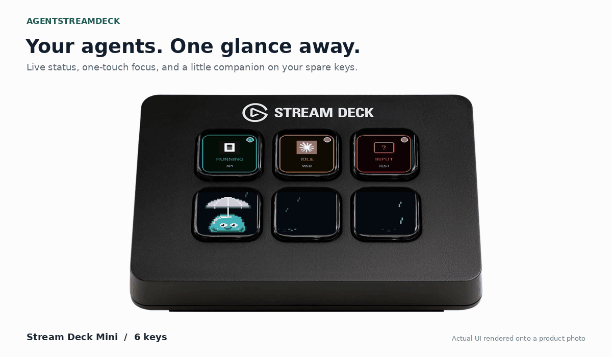
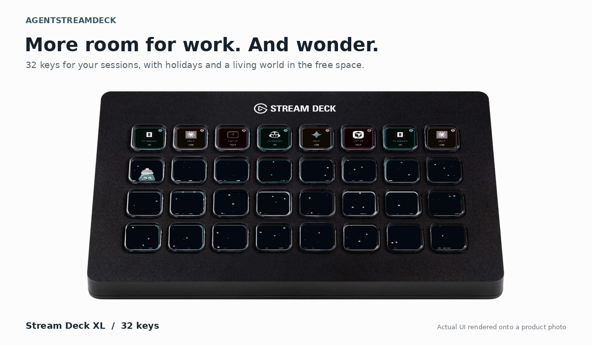

# AgentStreamDeck on Mini, MK.2 and XL

[Project overview](../../README.md) · [Full visual gallery](../GALLERY.md) · [Hardware setup](../features/HARDWARE.md)

These previews composite the project's actual button and Jelly renderers into photographs of real Stream Deck models. They are illustrative composites, not hardware recordings or USB performance measurements. Each model has its own row-by-row LCD calibration so the original housing, key spacing and perspective remain visible.

## Mini: six keys, plenty of personality

Running, idle and input states occupy the first row. Jelly and weather use the remaining keys. [Status meanings](../features/STATUS.md) · [Jelly behavior](../JELLY.md).

## MK.2: choose your look

Columns compare **studio, neon, focus, readable and marquee**. Rows explicitly override their motion to compare **breathe, glow and steady**. These combinations demonstrate per-button customization, rather than unmodified preset defaults. [Every appearance field](../reference/APPEARANCE.md) · [Layouts, themes, labels, badges and borders](../GALLERY.md).

## XL: room for parallel work

Thirty-two keys provide more room for sessions and free-space scenes. Jelly does not take ownership away from an agent. [Supported geometry and device selection](../features/HARDWARE.md).

## Rain, snow and autumn

Individual drops fall and splash, snow drifts, and leaves flutter toward the floor. World scenes are explicitly selected for these offline previews; they do not represent live weather. [Configure weather and holidays](../jelly/world.md) · [All 75 scenes](../jelly/world-catalog.md) · [Longer activity timelines and cleanup](../jelly/living-world-development.md).

## Image sources and reproduction

Product photographs and Elgato marks belong to their respective owners and are not covered by this repository's Apache software license. Source pages were consulted for the September 2026 documentation refresh. Their inclusion illustrates compatible hardware, not an endorsement.

| Model | Photo source | Manufacturer reference |
|---|---|---|
| Mini | [MaxGaming product photograph](https://www.maxgaming.no/bilder/artiklar/zoom/13148_2.jpg?m=1588923933) | [Elgato Mini](https://www.elgato.com/us/en/p/stream-deck-mini) |
| MK.2 | [JB Hi-Fi product page](https://www.jbhifi.com.au/products/elgato-stream-deck-mk-2-black) | [Elgato device comparison](https://www.elgato.com/us/en/explorer/products/stream-deck/stream-deck-device-comparison/) |
| XL | [GearTechs product page](https://geartechs.com/products/elgato-stream-deck-xl-expanded-32-key-tactile-control-surface) | [Elgato XL](https://www.elgato.com/us/en/p/stream-deck-xl) |

Additional angles and sizes were reviewed through Elgato, Xcite, OCTO24 and HEXUS. The three front-facing views above keep the small LCD content readable. Original/MK.2 shares the supported 15-key layout; the photo shown is MK.2.

Run `python scripts/readme_hero.py` from the repository root after installing development dependencies. It reads the three local JPEGs, invokes the production renderers with networking disabled, composites each LCD, and regenerates this gallery plus the existing `docs/jelly/readme_hero.gif` URL. It also creates a still for each model. The captions use DejaVu Sans when installed, with a Pillow fallback.

The preview advances at 12 frames per second with a shared palette sampled across each reel. The broker's actual animation rate and device throughput are independent. Native pixel previews remain in the [Jelly artwork documentation](../jelly/artwork.md).
