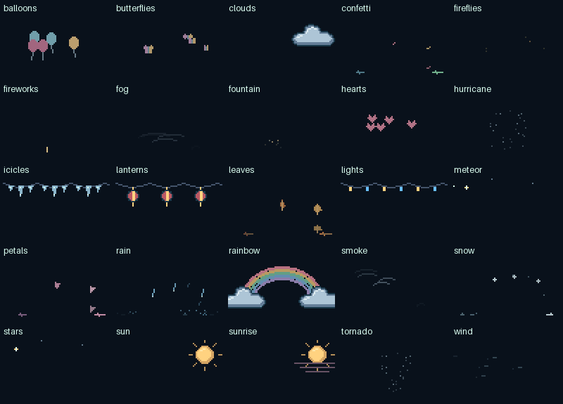

# Jelly world artwork

[World setup](world.md) · [75 scene recipes](world-catalog.md) · [Design contract](../development/DESIGN_SYSTEM.md)

## Objects at their own scale

All world props were redrawn around recognizable silhouettes, material shading and intentional movement. This gallery shows the same art at 1× logical size and 2×. Jelly itself, including its body, face, palette and poses, is unchanged.


[Still object inventory](world-objects.png)

| Family | Visual treatment and movement |
| --- | --- |
| Plants and autumn | Lobed and veined leaves; textured acorn cap and pointed nut; swaying stems; layered evergreen with small lights |
| Food and drinks | Plates instead of identical oversized tables; pie crust, frosting, garnish, glass and ceramic details; rising steam and candle flames |
| Toys and tools | Separate fan grille and pinwheel blades; kite tail, windsock opening and stripes; rake tines, broom bristles, telescope tripod; turning train wheels |
| Winter | Shaded snow forms, snowman scarf and twig arms; branched snowflakes; distinct dripping icicles; compact airborne snowball |
| Celebrations | Folded envelopes, gift lid and ribbon, wrapped sweets, colored powder bowls, floor rangoli; hanging lantern ribs and distinct lamps |
| Sky and water | Lobed clouds with shaded undersides; moon and balloon highlights; puddle ripples; rain inside window panes |

Every prop has eight cyclic held poses. Stationary objects use subtle material changes, such as a glint or warm light, rather than arbitrary whole-object movement. Poses advance at four per second. Reduced motion freezes them.

## Atmosphere is part of the scene



[Rain, snow and leaf contact review](weather/README.md). Natural particle motion follows elapsed time on every rendered frame; droplets splash, flakes settle, and leaves lie sideways before fading.

Stars keep their positions as they twinkle. Fireflies wander slowly, butterflies flap, balloons rise and leaves tumble. Fog stays low, smoke rises in small curls, and clouds retain a continuous lit silhouette. Fireworks have launch, expansion and fading stages. Weather and decorative particles remain behind Jelly. A scene can deliberately be scenery-only, such as cloud watching.

## Composition and crowded decks

Props and Jelly share the same logical pixel scale. Solid objects meet a common floor with a restrained contact shadow. Airborne objects retain headroom. A small nut is never enlarged to fill an empty button.

The renderer chooses a free neighbor that is not part of a current Jelly crop, then another available key. A single free key gets a compact corner vignette behind the character, so some fine detail is intentionally sacrificed there. No free keys means no decorations. The sun, rainbow and toy wind funnels are placed on available keys rather than hidden behind session buttons. Falling and drifting particles are clipped to individual free-key viewports, with separate floor contact and seeded variation. Stars and supported decorative fixtures retain the shared deck composition.

Existing CLI controls govern props, particles, costumes, reduced motion and maximum keys. `interactions` enables object use and `interaction_seconds` controls the interval between activities; see [Jelly using its props](world.md#jelly-can-use-its-props). Existing configuration files receive the new defaults.

## Audit scope

The refactor covers every prop and sky renderer, plus all world costume overlays. Hats now distinguish folded fabric, knitted ribs, straw brims and party cones; other accessories gain edges, seams or material highlights. The existing Buy Me a Coffee logo and animated steam, update arrow and readable status text were inspected and retained. They are branded or functional UI, not ambiguous world motifs. Jelly's character artwork was not changed.

## Complete renderer inventory

**Objects (57):** `acorn`, `balloon`, `beachball`, `broom`, `cake`, `candy`, `canister`, `clock`, `cloud`, `clover`, `cocoa`, `crescent`, `diya`, `dreidel`, `eggs`, `fan`, `feast`, `flower`, `fountain`, `gift`, `globe`, `grass`, `heart`, `icicles`, `kite`, `lamp`, `lantern`, `leaf`, `lemonade`, `letter`, `menorah`, `mittens`, `music`, `pie`, `pinwheel`, `popsicle`, `pot`, `powder`, `puddle`, `pumpkin`, `rake`, `rangoli`, `rocket`, `sandcastle`, `scythe`, `seedling`, `sled`, `snowangel`, `snowball`, `snowflake`, `snowman`, `sweets`, `telescope`, `train`, `tree`, `window`, `windsock`.

**Atmosphere (25):** `balloons`, `butterflies`, `clouds`, `confetti`, `fireflies`, `fireworks`, `fog`, `fountain`, `hearts`, `hurricane`, `icicles`, `lanterns`, `leaves`, `lights`, `meteor`, `petals`, `rain`, `rainbow`, `smoke`, `snow`, `stars`, `sun`, `sunrise`, `tornado`, `wind`.

[The second art review](prop-review.md) records an individual assessment of all 57 props and shows the implemented manipulation sequences.

## Reproduce and verify

```console
python scripts/preview_world.py
python scripts/preview_world_art.py
python -m unittest discover -s tests -p test_world_art.py
```

The previews use production rendering code. Tests exercise all 75 scenes across Mini, Original/MK.2 and XL geometry at 72, 80 and 96 pixels, one or several free keys, zero free keys, source-frame immutability, foreground protection and reduced motion. Object tests require a visible animation change and a repeating eight-pose cycle. Automated rendering cannot establish recognition or smoothness on physical hardware; review these previews and validate on the device.
