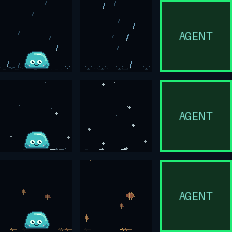
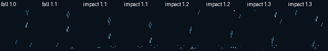
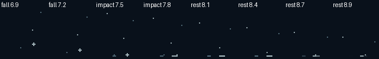
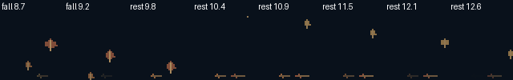

# Natural weather particles

[World settings](../world.md#natural-weather-particles) · [All atmosphere effects](../artwork.md)

Rain, snow and falling material have independent starts, speeds, depth, contact and disappearance. Each free button is a small space with its own floor. Particles no longer march through one shared deck-height loop or form a strip along the bottom row.

| Effect | Motion and contact |
| --- | --- |
| Rain | Fast beads and short streaks with varied lengths, brightness and speeds; brief outward splash droplets and a small fading ripple |
| Snow | Small specks and branched flakes; slower individual descent with sideways drift, contact puffs and fading ground flecks |
| Leaves | Tumble and flutter during descent; flatten sideways on contact, rest briefly and fade without sinking |
| Petals and confetti | Independent flutter, small ground contact, short rest and disappearance |
| Wind | Short, scattered wind-carried flecks rather than synchronized horizontal strips |
| Fog and smoke | Separate low wisps or rising curls with gradual birth and disappearance |
| Fireflies and butterflies | Independent wandering, pulse/flap rates and positions |
| Clouds, balloons and hearts | Different drift/rise rates and starting positions; compact silhouettes |
| Fireworks and fountain sparks | Independent launches and gravity-shaped spark paths that fade |
| Toy tornado and hurricane | Orbiting dust particles rather than stacked animated lines; decorative scenes, not weather alerts |

Stars, the sun, rainbow and supported light strings keep their recognizable authored shapes. These are sky landmarks and fixtures, not falling material.

## Native production previews

Rows show rain, snow and leaves. The green right-hand cells represent occupied agent keys and receive no weather. Both free cells retain their own floor. Jelly stays in the foreground.



[80px Original/MK.2](particles-80.gif) · [96px XL](particles-96.gif)

Contact studies show successive samples through the real particle lifetime:







The native 72/80/96px frames and temporal contact studies were inspected for particle separation, relative size, ground contact, disappearance and foreground protection. The refreshed [25-effect gallery](../world-atmosphere.gif) includes the other backgrounds. This is offline visual verification; physical Stream Deck testing was not available.

## Controls and implementation

Existing `ocdeck world configure --no-particles`, `--reduced-motion` and `--max-keys` controls continue to apply. No new setting is required. Restart after configuration changes. Reduced motion freezes particle time. No free cells means no world drawing; newly owned cells receive no particle overlay.

`world_particles.py` samples immutable particles from elapsed seconds and bounded cached seed values. It performs no filesystem or network work, uses no shared mutable random source and does not advance by frame counts. Respawns receive a fresh position only after the previous lifetime ends. `World.decorate` supplies smooth elapsed time and a stable key seed, then clips/composites each local effect behind Jelly.

Fallen atmospheric leaves fade independently of the leaf pile in Jelly's existing rake activity. This change does not merge the separate unfinished living-world refactor.

## Reproduce and measure

```console
python scripts/preview_weather_particles.py
python scripts/preview_world_art.py
python scripts/benchmark_weather.py
python -m unittest discover -s tests -p test_world_particles.py
```

The benchmark optionally accepts the path of another checkout for a baseline comparison. [Comparison data](comparison.json) records identical layouts, scenes, seed, availability and sample counts. It excludes the first 60 of 300 frames and measures CPU composition with all keys free. [Preview capture timings](render-metrics.json) measure the smaller two-free-cell reels and include transient first-use costs. Neither measures USB timing, actual device frame rate or isolated cold-cache performance.

Independent lifetimes and per-key floor effects cost more than uniform scrolling. The benchmark records that difference openly. Particle counts, seed caches and palette caches are bounded; only currently available keys are composed. Semantic tests cover fall/contact/expiry order, varied rain speeds, stationary leaf fading, elapsed-time reproducibility, per-key clipping, intermediate frame updates and reduced motion.
