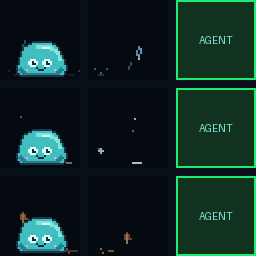

# Jelly's living world

Jelly celebrates holidays, wears costumes, watches the weather and enjoys small seasonal activities across your unused Stream Deck buttons. There are **75 selectable scenes**, including **50 additional experiences** beyond the original holiday and weather set. Agent keys remain dedicated to your sessions.


[Scene catalog](world-catalog.md) · [Design contract](../development/DESIGN_SYSTEM.md) · [Jelly settings](../reference/JELLY.md) · [CLI](../CLI.md#world)

## Readable scenery and quieter motion

Objects share Jelly's pixel scale: an acorn is smaller than a mug, and a tree is taller than either. Contact shadows ground solid props. Steam, flickering candles, rotating fan blades, fluttering ribbons and rippling water give each scene its own movement. Stars twinkle in place; balloons rise; leaves have lobes and veins. Clouds have lit tops and shaded undersides.

Objects appear only when Jelly has an achievable activity for them. Their initial cells are chosen from the reachable free region with seeded variety; Jelly hops to the actual cell before contact. Tools have racks, cups have coasters, and plants stay rooted. One free key uses a compact local activity; no free keys means no world content.

[Inspect every object and atmosphere effect](artwork.md). The existing `--no-props`, `--no-particles`, `--no-costumes`, `--max-keys` and `--reduced-motion` controls apply to the new artwork; the interaction controls below add short object-use sequences. Reduced motion freezes decorative animation. Restart after changing settings.

## Natural weather particles

Rain uses independent fast drops, varied streak lengths, and brief ground splashes. Snowflakes drift at different speeds and settle into tiny fading flecks. Leaves flutter and turn while falling, land sideways, and fade on the floor. Petals and confetti also settle before disappearing. Fog and smoke form small wisps; wind carries scattered flecks instead of repeated horizontal strips.

Each free key has its own floor and particle seed. Motion follows elapsed time at the configured frame rate, so particles do not march in one repeating sheet. Existing `--no-particles`, `--reduced-motion` and `--max-keys` controls still apply; no new configuration is needed. Ground fading is an ambient visual effect, separate from Jelly's raked leaf pile.



[Native 72px preview](weather/particles-72.gif) · [Native 96px preview](weather/particles-96.gif) · [Particle review and measurements](weather/README.md)

## Jelly can use its props

Jelly can approach a rake, pick it up, gather leaves, put it down and admire the pile. Other sequences include sipping cocoa, opening a gift or letter, watering a plant, bouncing a ball, spinning a dreidel, pushing a train, looking through a telescope, blowing a pinwheel, tasting a treat, building snowmen or sandcastles, and blowing out birthday candles.


[Interaction gallery and review of every prop](prop-review.md). Props have separate resting, held, in-use and outcome sprites. Clouds, the moon and other scenery remain environmental.

```console
ocdeck world configure --interactions --interaction-seconds 24
ocdeck world configure --no-interactions
ocdeck world preview autumn_rake --output raking.gif
```

Living-world activities are enabled by default. `interaction_seconds` (12–300, default 24) sets the quiet interval after cleanup. An active activity survives scene rotation. `--no-interactions`, `--no-props`, `--no-living-world` and reduced motion suppress physical activities and their objects; they never restore unattended decorative props. Natural background weather can remain. Restart the broker after changing settings.

The director rechecks available keys every frame. Touch, hold/help, menus, agent attention, updates, coffee and ownership changes take priority. Interrupted objects go into logical storage; material progress is retained and routes are revalidated before resuming. Completed work is admired, followed by a short rest and a gentle fade into storage. The Buy Me a Coffee interaction keeps its existing controls.

Plants and projects retain identity and growth across later visits when Jelly persistence is enabled. Memory is bounded to eight objects and 24 recent activities. Gifts create one toy that Jelly plays with next; fountains lead to a water-carrying journey, and windsock checks lead to kite play. Being away does not create missed chores or neglect penalties.

```console
ocdeck world configure --living-world --interactions --props
ocdeck world reset
```

`world reset` resets only world memories on the next broker restart, preserving Jelly's needs and preferences. It uses a generation marker so a still-running broker cannot overwrite the reset with an old snapshot. Existing `jelly.persistent` controls saving. [Architecture, coverage and reproducible review](living-world-development.md).

## Quick start

World scenes are enabled with Jelly by default. Automatic location uses approximate IP geolocation; weather refreshes every 15 minutes. No account or API key is needed for the bundled personal-use services.

```console
ocdeck world show
ocdeck world catalog
ocdeck world configure --country US --timezone America/New_York --units F
```

Restart the broker after configuration changes. Use your normal service/task restart, or `ocdeck stop` followed by `ocdeck broker` for a foreground session. This does not restart your coding agents.

To choose your location explicitly:

```console
ocdeck world configure --latitude 34.2 --longitude -84.1 --country US --timezone America/New_York --no-auto-location
```

The example is a coarse coordinate pair, not a street address. Use your own coordinates. A manual pair always bypasses IP lookup even when `auto_location=true`. Set both coordinates to empty strings to return to automatic location. Country and timezone alone do not locate weather.

## Configuration

Hold Jelly for 0.9 seconds to see **JELLY SETUP / jelly.ini / Hold: docs / Tap: close**. Hold again within 20 seconds to open this page. Tap closes help. The character stays put while help is visible. This works even when launcher controls are disabled. `--no-hold-help` restores the previous tap routing.

When location is missing, Jelly periodically says “Location unknown. Hold Jelly for setup.” The default reminder interval is 30 minutes. Valid weather captions appear every 90 seconds and scroll on small keys. A fresh tap reaction has priority over a weather caption. Configure frequency or disable captions entirely.

`ocdeck world configure` creates `jelly.ini` in the existing AgentStreamDeck data directory: `%USERPROFILE%\.opencode-deck` on Windows, `~/.opencode-deck` elsewhere, or `OCDECK_HOME` when set. It writes the complete effective world configuration. You may edit the file directly:

```ini
[world]
enabled = true
country = US
timezone = America/New_York
units = F
latitude = 34.2
longitude = -84.1
auto_location = false
weather = true
holidays = true
seasons = true
caption_seconds = 90
hint_seconds = 1800
birthday = 05-16
```

Omitted values use defaults. Existing `config.json` values under `world` are accepted; `jelly.ini` takes precedence. Other Jelly personality settings remain in `config.json`. Malformed configuration is rejected rather than silently replaced. `ocdeck world validate` checks configuration without contacting providers.

### Common recipes

```console
ocdeck world configure --no-weather --no-auto-location
ocdeck world configure --no-particles --reduced-motion
ocdeck world configure --quiet-start 22 --quiet-end 7
ocdeck world configure --holiday-ids july4,thanksgiving,christmas,holi,easter,halloween
ocdeck world configure --disabled-scenes reaper_stroll,smoke_bombs
ocdeck world configure --caption-seconds 30 --hint-seconds 900
ocdeck world configure --hemisphere south --units C
ocdeck world configure --max-keys 3
ocdeck world configure --no-enabled
```

Each boolean also supports its positive flag. Empty `holiday_ids` disables the selected festival list; `--no-holidays` is the simpler master switch. Empty `disabled_scenes` reenables all scene recipes. Use `--quiet-start -1 --quiet-end -1` to disable quiet hours. `--no-enabled` turns off the world layer while retaining ordinary Jelly.

## Holidays and priority

The default is a curated global selection, not every public holiday or every religious tradition. Each festival is individually selectable through `holiday_ids`. No country setting forces a person to observe a holiday.

| ID | Calendar and default window |
| --- | --- |
| `july4` | July 3–5; fireworks, fountains and color smoke |
| `thanksgiving` | US fourth Thursday in November ±1 day; Canada second Monday in October ±1 day when country is CA |
| `christmas` | December 13–26; lights, Santa, elves, gifts, snow and train |
| `halloween` | October 24–November 1; ghost, skeleton, mask, reaper and witch |
| `holi` | Year-specific Uttar Pradesh calendar date ±1 day |
| `easter` | Western Gregorian Easter Sunday ±1 day |
| `newyear` | December 31–January 2 |
| `valentine` | February 14 ±1 day |
| `lunar` | Chinese Spring Festival first day ±1 day |
| `diwali` | Year-specific Uttar Pradesh calendar date ±1 day |
| `eid` | Eid al-Fitr using the India/UP calendar ±1 day |
| `hanukkah` | Hebrew calendar 25 Kislev, full eight civil days plus the pre-window |
| `patrick` | March 17 ±1 day |
| `earth` | April 22 ±1 day |
| `birthday` | Your configured MM-DD ±1 day; leap-day birthdays occur on February 29 |

Regional observances can differ, particularly lunar and sighting-based festivals. These are daytime scene dates; evening-start traditions are not timed to sunset. Set the selected holiday list or use an explicit scene/date override for a different observance. `before_days` and `after_days` control general windows; Halloween and Christmas have longer configurable lead-ins. Hanukkah retains its eight-day span.

An exact celebration day outranks another holiday's surrounding window. Birthday has the highest collision priority, followed by Christmas, New Year, July Fourth/Thanksgiving/Halloween, movable festivals and smaller events. Scenes within the winning context rotate every 24 seconds. Turning off every recipe for that context intentionally leaves ordinary Jelly rather than substituting a different holiday.

## Weather and location

The broker uses [IPWhois](https://ipwhois.io/documentation) for approximate automatic location and [Open-Meteo](https://open-meteo.com/en/docs) for modeled current temperature, WMO weather code, wind speed and day/night. Explicit location wins; explicit country/timezone win over discovered values. Without a discovered timezone, the system timezone is used. The OS locale can suggest a country but cannot determine coordinates. VPN and corporate egress addresses may locate another city; manual coordinates fix this.

Requests go directly from the broker to those providers. IP lookup reveals the connection's public IP; weather requests include the configured/discovered coordinates. No agent information, prompts, repository paths or authentication tokens are sent. Coordinates and weather snapshots stay in memory unless you explicitly save coordinates in configuration. IP location is reused for a day; weather uses a minimum five-minute poll interval, 15 minutes by default. Each request has a five-second timeout and a 64 KiB response limit. Failures retry at the configured poll interval, never on every frame.

Cached observations older than `stale_seconds` (one hour by default) stop being presented as current. Weather failure leaves offline holiday/season scenes working. `--no-weather --no-auto-location` prevents world network requests. Mock brokers and scene previews do not start provider requests.

Weather presentation includes rain, snow, clouds, fog, heat at 32°C or above, wind at 35 km/h or above, and thunderstorms. Precipitation and storm codes take precedence over heat/wind. A rain-to-clear transition enables the rainbow scene for five minutes. Temperatures use Fahrenheit for US auto units and Celsius otherwise. A manually selected weather override is labeled **Demo weather**, and a scene override is labeled **Preview**; neither invents a measured temperature.

Tornado and hurricane recipes are **manual demo scenes only**. Open-Meteo's current weather code does not identify a tornado, hurricane or straight-line-wind event. The strong-wind recipe reflects speed, not an official alert. Jelly is an ambient weather companion, not an emergency warning service. Provider usage terms apply; the bundled free endpoints are intended for personal/noncommercial use. Review provider terms before managed commercial deployment.

## Space and accessibility

Supports Mini 2 × 3, Original/MK.2 3 × 5 and XL 4 × 8. Effects share deck coordinates and crop around occupied keys. Props prefer an empty adjacent key; with only Jelly's key available, they shrink beside him. With no free keys, scenes disappear immediately. A ready button is also reserved. Launcher menus, permission review, update prompts and coffee interludes take priority.

`max_keys` limits decorated keys, with Jelly's current key first. `reduced_motion` freezes world effects and holds Jelly still during active scenes. `particles`, `props` and `costumes` can be independently disabled. Quiet hours suppress the world layer, leaving the existing Jelly behavior. Global `animations=false` or `jelly.enabled=false` disables Jelly and its world completely.

## Preview without a device

```console
ocdeck world preview ghost_hover --keys 6 --output ghost.gif
ocdeck world preview christmas_lights --keys 32 --output lights.gif
ocdeck world configure --scene-override sky_fireworks
ocdeck world configure --scene-override ""
```

The first two commands create offline GIFs. The latter two select and clear a persistent on-device preview override. `date_override=YYYY-MM-DD` changes only scene scheduling, not the system clock. `weather_override=rain` selects demo weather. Clear overrides after trying them.

## Complete settings reference

The table below is generated from the same defaults as the CLI. All fields accept the corresponding hyphenated flag; the `help` field uses `--hold-help` to avoid the CLI's standard `--help` flag. Boolean flags also support `--no-…`. String lists use comma-separated IDs without brackets.

| INI field | Default | CLI flag |
| --- | --- | --- |
| `enabled` | `true` | `--enabled` / `--no-enabled` |
| `holidays` | `true` | `--holidays` / `--no-holidays` |
| `weather` | `true` | `--weather` / `--no-weather` |
| `seasons` | `true` | `--seasons` / `--no-seasons` |
| `costumes` | `true` | `--costumes` / `--no-costumes` |
| `particles` | `true` | `--particles` / `--no-particles` |
| `props` | `true` | `--props` / `--no-props` |
| `interactions` | `true` | `--interactions` / `--no-interactions` |
| `interaction_seconds` | `24` | `--interaction-seconds` (12–300) |
| `captions` | `true` | `--captions` / `--no-captions` |
| `help` | `true` | `--hold-help` / `--no-hold-help` |
| `auto_location` | `true` | `--auto-location` / `--no-auto-location` |
| `reduced_motion` | `false` | `--reduced-motion` / `--no-reduced-motion` |
| `country` | `auto` | `--country` |
| `timezone` | `auto` | `--timezone` |
| `latitude` | `empty` | `--latitude` |
| `longitude` | `empty` | `--longitude` |
| `hemisphere` | `auto` | `--hemisphere` |
| `units` | `auto` | `--units` |
| `poll_seconds` | `900` | `--poll-seconds` |
| `stale_seconds` | `3600` | `--stale-seconds` |
| `scene_seconds` | `24` | `--scene-seconds` |
| `caption_seconds` | `90` | `--caption-seconds` |
| `hint_seconds` | `1800` | `--hint-seconds` |
| `hold_ms` | `900` | `--hold-ms` |
| `before_days` | `1` | `--before-days` |
| `after_days` | `1` | `--after-days` |
| `halloween_days` | `7` | `--halloween-days` |
| `christmas_days` | `12` | `--christmas-days` |
| `birthday` | `empty` | `--birthday` |
| `quiet_start` | `-1` | `--quiet-start` |
| `quiet_end` | `-1` | `--quiet-end` |
| `max_keys` | `32` | `--max-keys` |
| `holiday_ids` | `july4,thanksgiving,christmas,holi,easter,halloween,newyear,valentine,lunar,diwali,eid,hanukkah,patrick,earth,birthday` | `--holiday-ids` |
| `disabled_scenes` | `empty` | `--disabled-scenes` |
| `scene_override` | `empty` | `--scene-override` |
| `weather_override` | `empty` | `--weather-override` |
| `date_override` | `empty` | `--date-override` |

### Valid ranges

`poll_seconds` and `stale_seconds`: 300–86400. `scene_seconds`: 8–600. `caption_seconds`: 15–86400. `hint_seconds`: 60–86400. `hold_ms`: 300–3000. `before_days` and `after_days`: 0–30. `halloween_days` and `christmas_days`: 0–31. `max_keys`: 1–32. Quiet hours: 0–23, or both -1 to disable; equal start/end disables the window. Coordinates: latitude -90…90, longitude -180…180, both finite or both empty. Timezone: `auto` or an IANA name. Country: `auto` or supported uppercase ISO code. Hemisphere: `auto`, `north`, `south`. Units: `auto`, `C`, `F`. Birthday: `MM-DD`. Date override: `YYYY-MM-DD`. Weather override: empty, `clear`, `cloudy`, `rain`, `snow`, `hot`, `wind`, `storm`, `fog`.
